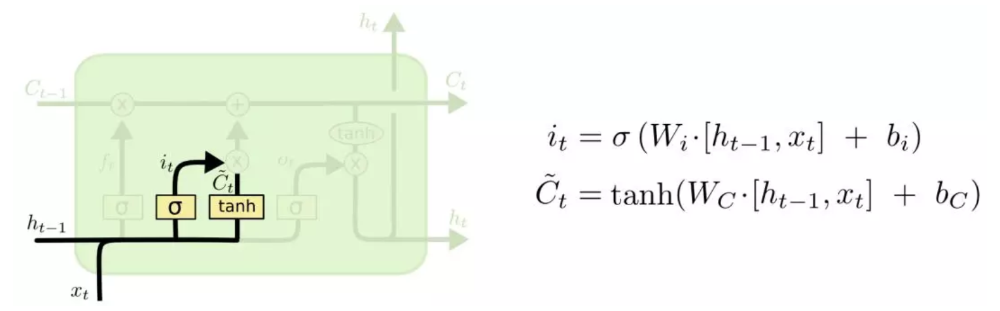

[TOC]

## 1、RNN
rnn的结构

>[一文搞懂RNN（循环神经网络）基础篇](https://zhuanlan.zhihu.com/p/30844905)
>微信文章：[深度学习NLP开篇-循环神经网络(RNN)](https://mp.weixin.qq.com/s?__biz=MzIyOTkyOTEzOQ==&mid=2247484021&idx=1&sn=eb9bb03f3019ef039a58a51df01f3203&chksm=e8ba7ba9dfcdf2bf5bd70d08c0fdd11561a388fea4d3d7745e48e490299bb1b89ac9061227b3&scene=21#wechat_redirect)

rnn结构是重复过程，权重W、U、V是共享的。

前向传播：
$$ S_t = f(U*X_t + W*S_{t-1})$$ 

$$ O_t=g(V*S_t)$$

U、W、V是权重参数，f是激活函数（通常是tanh），g是输出函数，通常是softmax

反向传播：

rnn的反向传播和DNN的反向传播基本一致，差别在于，因为RNN是序列的输入，反向传播是基于时间序列：**BPTT**。

推导 略todo）

## 2、LSTM

>[深度学习之美 第一篇：Understanding LSTM Networks](https://zhuanlan.zhihu.com/p/34556142)
>[LSTM原理及其实现](https://blog.csdn.net/gzj_1101/article/details/79376798)
[（译）理解 LSTM 网络 （Understanding LSTM Networks by colah）](https://blog.csdn.net/Jerr__y/article/details/58598296)

rnn由于在链式法则中， bptt过程会将梯度做连乘积，这就导致了**梯度爆炸和梯度消失**。LSTM（长短期记忆）将解决这个问题。lstm相比rnn，多了一些状态cell。

lstm的网络结构：输入：$h_{t-1}$ 、$x_t$，输出：$h_t$， 状态 $c_{t-1}$、$c_t$

lstm引入了3个门来解决长期依赖问题：**遗忘门** 、**输入门** 、**输出门**

lstm最关键的地方在于， 细胞状态$C_t$ 横串序列的节点， Ct就像一条传送带，只会做少量的线性操作。这个结构，可以很方便的将之前的信息，长程的传输到下游

#### 2.1、遗忘门

遗忘门的作用是**决定哪些信息通过这个cell**，通过一个**sigmoid**（概率0到1）函数实现。
输入：$x_t$、$h_{t-1}$
输出:一个0-1的向量（sigmoid输出）。表示让$C_{t-1}$信息通过的比重。 0表示不让信息通过，1表示让所有信息通过。
遗忘门决定从上一个时刻舍弃（遗忘）掉什么信息。
#### 2.2、输入门

输入门的作用：**决定让多少新的信息加入到状态C中**。
实现方式：
1、sigmoid：产生更新的比例
2、tanh：产生该时刻需要更新到细胞中的内容： $\hat{C_t}$

然后，将更新细胞状态：将当前输入门的输出$i_t*\hat{C_t}$ 加到细胞中去

#### 2.3、输出门

输出门的作用是：**决定当前时刻输出什么值**。它依赖当前的细胞状态$C_t$,但需要根据当前的输入和状态， 算一个概率做过滤处理。
1、首先使用一个sigmoid层，算出当前$C_t$哪些信息被输出。
2、接着把$C_t$通过一个tanh层（归一到-1-1），然后和1中的sigmoid算出来的权重相乘，就得到最后的输出结果。

### 3、GRU
TODO: